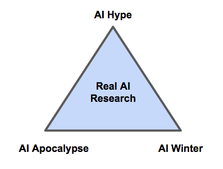

# AI Winter: Deep Learning and its Discontents

An [AI winter](https://en.wikipedia.org/wiki/AI_winter) is a time when funding and support for artificial intelligence research and commercial ventures dries up. AI went through various winters in the 20th century, when early promise turned to disillusion, and the best technologists turned their minds to other problems.  

Though many [definitions of AI](./ai-artificial-intelligence-definition) are overly vague, it is an important technology that receives a lot of media attention. That means a lot of people have opinions about it even if they are unfamiliar with how it works and what its limits are. This post gives you a framework by which to interpret opinions about AI, to situate someone who holds an AI opinion stands and understand who their allies and opponents are. Like most divisions of opinion, these differences roughly break down into "I like AI" or "I don't like AI", although there are several reasons why people have chosen not to like it. 

Broadly, there are two kinds of AI pessimists: One believes AI will become so strong that it destroys humanity, and another believes AI is so flawed, brittle, and overhyped as a technology that the sector will collapse. The first is afraid of killer robots, the second predicts that the next AI winter is on its way. These we could call the "winterists" and their ideology "AI winterism". Both kinds receive a lot of attention, although their claims are mutually exclusive. 

Everyone likes prophecies of doom: messages that arouse fear are more likely to go viral, because doomsday prophets play to our insecurities. Like a politician seeking re-election might launch a war on terror or a war on drugs, fearmongers standing at the edge of AI are waging a strange war on the technology. Their message of decline implies that they are superior due to their foresight, and that the rest of the world is headed blindly for disaster.  

```
“For reasons I have never understood, people like to hear that the world is going to hell.” - Deirdre McCloskey (historian)

“I have observed that not man who hopes when others despair, but the man who despairs when others hope, is admired by a large class of persons as a sage.” - John Stuart Mill
```

## Polarization of Opinions on AI

Discussions of AI are multipolar and increasingly polarized. That is, people are gravitating toward more and more extreme views about the future of AI and its impact on society. In addition to the two kinds of pessimism described above, you have AI hype. The boosters who seek to succeed alongside the technology. It is in their interest to make promises about AI, and to view a world with stronger AI through rose-colored glasses. 



At the center of all this sturm and drang, far from the poles of fear or hope, the hard, practical work of researching and implementing AI continues, pushed forward incrementally and independent of opinion, by researchers who are as aware of AI's limitations as its capabilities.  

## Politicization of AI

The issue of AI is becoming more and more politicized, and the political polarization has multiple axes. Political polarization has led to partisanship, paranoia and a loose relationship with the facts. In such situations, it's easy to see how both sides are wrong, or at least using unsound arguments. 

Within most developed countries, there are those who believe that AI will destroy jobs domestically through automation vs. those who believe that AI will create new industries and offset that unemployment. 

Internationally, there are those who believe the major powers are in an AI arms race vs. those who believe that AI is developing fast and well based on the open sharing of knowledge among research groups. 

In both cases, paradoxically, both sides are right. 

## AI Winterism

The main problem with AI winterism is that it seems to arise more from AI hype fatigue than actual contact with contemporary AI research. Sure, hype comes and goes, but AI research is moving so fast that most insiders have trouble keeping up, and AI capacity is tied to brute compute, which is also progressing. 

While fundamental AI research research and complementary technologies like raw compute are making progress, such advances are rarely linear. They come in bursts, and so does the media attention that is paid to them. You might say that AI hype is both cyclic and recurrent. The hype cycle doesn't happen just once. And each advance moves the base a little higher, a sinusoidal curve on an upward tilt. AI winter is a strong metaphorical frame that needs no explanation, and it implies that AI, as a technology, is doomed to be deflated. But you could reframe it by saying that each AI winter is like a cold season occurring on an ever warmer planet. Sure, the temperature goes down, but never quite as much as the last time. 

## AI Winterists

* [AI Winter is Well on Its Way](https://blog.piekniewski.info/2018/05/28/ai-winter-is-well-on-its-way/)
* [AI Winter - Addendum](https://blog.piekniewski.info/2018/06/06/ai-winter-addendum/)

## AI Alarmists

* [Eliezer S. Yudkowsky's Website](http://yudkowsky.net/)
* [Nik Bostrom, the "Superintelligence" guy](https://nickbostrom.com/)
* [Max Tegmark and the Future of Life Institute](http://space.mit.edu/home/tegmark/)
* [Elon Musk](https://www.nytimes.com/2018/06/09/technology/elon-musk-mark-zuckerberg-artificial-intelligence.html)

## AI Boosters

* Most AI startups

## AI Pragmatists

* [Is machine learning currently overhyped? (Quora response by Scott Aaronson)](https://www.quora.com/Is-machine-learning-currently-overhyped/answer/Scott-Aaronson)
* [Yann LeCun](https://www.facebook.com/yann.lecun)
* [Geoff Hinton](http://www.cs.toronto.edu/~hinton/)

### Footnotes

* *In financial markets, these pessimists are called bears, and their optimistic counterparts are called bulls. Bulls and bears both have biases that color their predictions, and lead them to seek evidence to support their beliefs. Being a bull or bear is not so much a matter of being right or wrong as never being right at the same time as your opposite number. There's usually someone who calls the market right, and they play musical chairs with everyone else.* 
