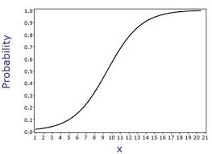

# Machine Learning With Deeplearning4j

While Deeplearning4j and its suite of open-source libraries - [ND4J](http://nd4j.org/), DataVec, Arbiter, etc. - primarily implement scalable, deep artificial neural networks, developers can also work with more traditional machine-learning algorithms using our framework.

## Algorithms Available on DL4J

* Linear Regression
* [Logistic Regression](./logistic-regression)
* [K-means clustering](https://deeplearning4j.org/doc/org/deeplearning4j/clustering/kmeans/package-tree.html )
* K nearest neighbor (k-NN)
* Optimizations of k-NN with a [VP-tree](https://en.wikipedia.org/wiki/Vantage-point_tree), [t-SNE](https://lvdmaaten.github.io/tsne/) and quad-trees as a side effect

## Algorithms Possible Using ND4J

ND4J is a generic tensor library, so the sky's the limit on what can be implemented. 

We are integrating with Haifeng Li's SMILE, or [Statistical Machine Intelligence and Learning Engine](http://haifengl.github.io/smile/), which implements more than one hundred different statistical and machine-learning algorithms, including random forests and GBMs. SMILE shows the best performance of any open-source JVM-based machine-learning library we've seen. 

# Popular Machine Learning Algorithms

WIP.

## Linear Regression

Linear regression is a simple algorithm, and that makes it a great place to start thinking about algorithms in general. Here it is:

```
ŷ = a * x + b
```

Read aloud, we'd say "y-hat equals a times x plus b." 

* y-hat is the output, or guess made by the algorithm, the dependent variable.
* a is the coefficient. It's also the slope of the line that expresses the relationship between x and y-hat.
* x is the input, the given or independent variable.
* b is the intercept, where the line crosses the y axis.

Linear regression expresses a linear relationship between the input x and the output y; that is, for every change in x, y-hat will change by the same amount no matter how far along the line you are. The x is transformed by the same a and b at every point. 

Linear regression with only one input variable is called Simple Linear Regression. With more than one input variable, it is called Multiple Linear Regression. An example of Simple Linear Regression would be attempting to predict a house price based on the square footage of the house and nothing more. 

```
house price estimate = a * square footage + b
```
Multiple Linear Regression would take other variables into account, such as the distance between the house and a good public school, the age of the house, etc.  

The reason why we're dealing with y-hat, an estimate about the real value of y, is because linear regression is a formula used to estimate real values, and error is inevitable. Linear regression is often used to "fit" a scatter plot of given x-y pairs. A good fit minimizes the error between y-hat and the actual y; that is, choosing the right a and b will minimize the sume of the differences between each y and its respective y-hat.  

That scatter plot of data points may look like a baguette -- long in one direction and short in another -- in which case linear regression may achieve a fit. (If the data points look like a meandering river, a straight line is probably not the right function to use to make predictions.)


## Logistic Regression

Let's analyze the name first. Logistic regression is not really regression, not in the sense of linear regression, which predicts continuous numerical values. Logistic regression is actually a classifier that acts like a light switch. A light switch essentially has two states, on and off. Logistic regression takes input data and classifies it as `category` or `not_category`, on or off expressed as 1 or 0, based on the strength of the input's signal. Logistic regression takes input data and *squishes* it, so that no matter what the range of the input is, it will be compressed into the space between 1 and 0. Notice, in the image below, no matter how large the input x becomes, the output y cannot exceed 1, which it asymptotically approaches, and no matter low x is, y cannot fall below 0. That's how logistic regression compresses input data into a range between 0 and 1, through this s-shaped, sigmoidal transform. 



## Decision Tree

## Random Forest

## Support-Vector Machine (SVM)

## Naive Bayes

## k-Nearest Neighbors (KNN)

## k-Means

## Dimensionality Reduction

## Gradient Boosting Algorithms

