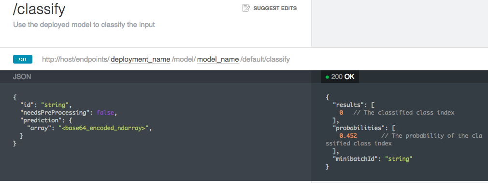

# Machine Learning Server for Inference in Production 

Deeplearning4j serves machine-learning models for inference in production using the free community edition of SKIL, the [Skymind Intelligence Layer](https://skymind.ai/products). 

You can visit [SKIL's Machine Learning Model Server Quickstart](https://skymind.readme.io/v1.0.1/docs/quickstart) to test it out. Here is the Swagger documentation to the [machine learning server's API](https://docs.skymind.ai/v1.0.3/reference).

 

A model server serves the parametric machine-learning models that makes decisions about data. It is used for the inference stage of a machine-learning workflow, after data pipelines and model training. A model server is the tool that allows data science research to be deployed in a real-world production environment.

What a Web server is to the Internet, [a model server is to AI](https://docs.google.com/presentation/d/1psNOQ3ZpPFeak2zsjO5EgUS-ypoFeyw-3eiLNvyEZzg/edit?usp=sharing). Where a Web server receives an HTTP request and returns data about a Web site, a model server receives data, and returns a decision or prediction about that data: e.g. sent an image, a model server might return a label for that image, identifying faces or animals in photographs. 

SKIL is like Apache Web server, and a machine learning model in this analogy is like a PHP file. The model is just a matrix with a bunch of weights. You want to put the machine-learning model on a server and access it from other locations. Just like a PHP file, it has source code, and to put it on the Internet, you put in on a server.

The SKIL machine learning model server is able to import models from Python frameworks such as Tensorflow, Keras, Theano and CNTK, overcoming a major barrier in deploying machine learning models to production environments.

Production-grade model servers have a few important features. They should be:

* Secure. They may process sensitive data. 
* Scalable. That data traffic may surge, and predictions should be made with low latency.
* Stable and debuggable. SKIL is based on the enterprise-hardened JVM.
* Certified. Deeplearning4j works with CDH and HDP.
* Implemented in a common protocol like REST.

## Skymind Intelligence Layer (SKIL)

SKIL meets all of those criteria. Briefly, SKIL is a:

### Machine Learning Solution Platform

* ETL: Build data pipelines with Pandas, DataVec
-- Persistent and reusable ETL
* Training
-- Spark coordinates work over multiple GPUs and CPUs
-- Recurrent updates of models
* Inference
-- One-click AI model deployment
-- Robust, fault-tolerant, load-balanced, auto-elastically scales
-- Serves any model specified in PMML

### Tool Aggregator
* Python: Tensorflow, Keras, scikit-learn, Pytorch, Numpy, Pandas
* Java/Scala: Deeplearning4j, ND4J, DataVec, SMILE

### Resource Portal
* Solves infrastructure problems for data scientists automatically
* Multi-cloud and Hybrid
* Point and shoot: Data scientists use whichever servers are available
* On-prem: Integrations with Hadoop, Spark, Kafka, ElasticSearch, Cassandra
* Public Cloud: AWS, Azure, Google Cloud

### Machine Learning Model Server
* Model management & monitoring
* Performance tracking - champion and challenger ranking
* Collaborative workspace
-- Clone experiments
-- Track progress
* Auditing: which data and users touched a model?
* High uptime (backed by an SLA)
* Rollbacks
* A/B Testing (2018)
* REST API

SKIL is enterprise tested. Skymind’s clients include the US Department of Homeland Security, Softbank, France Telecom and Ericsson, among others. 

# More Machine Learning Servers & Platforms

## TensorFlow Serving

[TensorFlow Serving](https://www.tensorflow.org/serving/) is one way to serve machine-learning models. It uses the gRPC protocol rather than REST, which most developers use because it's easy to integrate into a pipeline.

Tensorflow Serving requires that you build from source, use a Docker container or use Google Cloud ML. Docker won't work in a lot of legacy environments. Many people using Docker assume the environment is Kubernetes. Not every company is working on new infrastructure, and must answer the question of how they deploy on their legacy infrastructure today. 

Building from source won't work in a managed environment or on Windows. It decreases productivity and won't be manageable by IT, and it doesn't allow for repeatability in deployment. It's hard to extend TensorFlow serving because it's essentially a snowflake when you build from source. Most of the drawbacks here come down to limited mobility.

## Azure ML 

[Azure ML](https://www.dominodatalab.com/) is a drag-and-drop GUI engine that relies on the public cloud.. As such, it lacks flexibility and platform mobility. SKIL runs in more environments, and offers developers more flexibility through a REST API. 

## AWS Sagemaker 

AWS Sagemaker includes a machine learning server that requires that you [write your own Python code to serve models](https://docs.aws.amazon.com/sagemaker/latest/dg/ex1-deploy-model.html) and spin up intances. 

AWS Sagemaker relies on Flask. Python code is harder to scale due to how it handles processes. More processes require more compute, so you need larger servers to run it on and it's harder to scale. Languages such as Go and Java have real threads, decreasing the need for additional compute. AWS Sagemaker is based on Docker. It does not include built-in ETL; you roll your own each time you deploy. SKIL offers data pipelines as micro-services that can be monitored for latency, security, roles-access and performance; Sagemaker in contrast is a black box. 

## Domino Datalab 

[Domino Datalab](https://www.dominodatalab.com/) is a hosted, collaborative data science platform that bundles TensorFlow and other open-source libraries, allowing data science teams to spin up cloud instances for model training; schedule instances to spin up (and spin down when training is over); and give teams transparency into experiments through model versioning.
